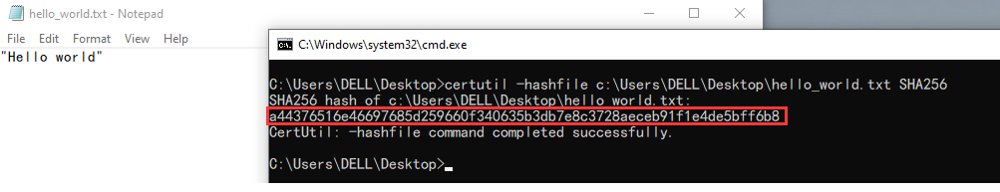
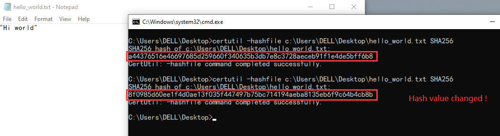

# Comptia Security + (SY0-701) Notes
> This is my personal notes for Security + SY0-701

## Pratical
### Hashing
Hashing is a technique that can convert a file/string or a data into a fixed length hash value.
A file hash is a long string of hexadecimal numbers that looks like a whole lot of gibberish, but it serves an invaluable purpose: it’s a way to check whether the integrity of a file has been compromised. 

#### How to hash a file in Windows
This is the command used to hash a file in Windows :
```
certutil -hashfile c:\example\test_file.txt SHA256
```

I created a txt format file called hello_world.txt, and type in *"Hello world"*
After that, I created a hash value for the file using the command :


I tried to make some changes in the file, and create hash value again after that :
(The hash value changed !!!)
