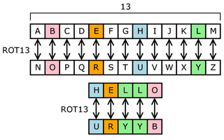

# Mod 26


## Question

AUTHOR: PANDU

Description :
Cryptography can be easy, do you know what ROT13 is? cvpbPGS{arkg_gvzr_V'yy_gel_2_ebhaqf_bs_ebg13_MAZyqFQj}

<hr>

## Solution
From the description, it is given a clue which called ROT13. So, what is ROT13 ?

ROT13 ("rotate by 13 places", usually hyphenated ROT-13) is a simple Caesar cipher used for obscuring text by replacing each letter with the letter thirteen places down the alphabet. A becomes N, B becomes O, and so on up to M, which becomes Z, then the sequence reverses: N becomes A, O becomes B, and so on to Z, which becomes M. The algorithm is used in online forums as a means of hiding joke punchlines, puzzle solutions, movie and story spoilers, and offensive materials from the casual glance. ROT13 has been described as the " Usenet equivalent of a magazine printing the answer to a quiz upside down" . The name "ROT13" originated on Usenet in the early 1980s, and the method has become a de facto standard. As a Caesar cipher (a method of encryption thousands of years old), ROT13 provides no real cryptographic security and is not used for such; in fact it is often used as the canonical example of weak encryption. An additional feature of the cipher is that it is symmetrical; that is, to undo ROT13, the same algorithm is applied, so the same code can be used for encoding and decoding. [[1](#1)]



[`reference here`](https://www.cs.mcgill.ca/~rwest/wikispeedia/wpcd/wp/r/ROT13.htm)

### Example

```
Before encode : We are a team
After decode : Jr ner n grnz
```

<div id='1'>Hello</div>

### Code

I wrote a **python** code to solve this question :D

```python

# String to decode
str_decode = "cvpbPGS{arkg_gvzr_V'yy_gel_2_ebhaqf_bs_ebg13_MAZyqFQj}"

# Create a mapping dictionary
rot13_map = {
    'a' : 'n',
    'b' : 'o',
    'c' : 'p',
    'd' : 'q',
    'e' : 'r',
    'f' : 's',
    'g' : 't',
    'h' : 'u',
    'i' : 'v',
    'j' : 'w',
    'k' : 'x',
    'l' : 'y',
    'm' : 'z',
    'A' : 'N',
    'B' : 'O',
    'C' : 'P',
    'D' : 'Q',
    'E' : 'R',
    'F' : 'S',
    'G' : 'T',
    'H' : 'U',
    'I' : 'V',
    'J' : 'W',
    'K' : 'X',
    'L' : 'Y',
    'M' : 'Z',
    'n' : 'a',
    'o' : 'b',
    'p' : 'c',
    'q' : 'd',
    'r' : 'e',
    's' : 'f',
    't' : 'g',
    'u' : 'h',
    'v' : 'i',
    'w' : 'j',
    'x' : 'k',
    'y' : 'l',
    'z' : 'm',
    'N' : 'A',
    'O' : 'B',
    'P' : 'C',
    'Q' : 'D',
    'R' : 'E',
    'S' : 'F',
    'T' : 'G',
    'U' : 'H',
    'V' : 'I',
    'W' : 'J',
    'X' : 'K',
    'Y' : 'L',
    'Z' : 'M'
}

print("Result : ", end='')

# Using for loop to decode character one by one
for i in str_decode :
    try :
        print(rot13_map[i], end='')
    except :    # if the character is not in mapping dictionary, then it will print out directly (example : The symbol { } )
        print(i, end='')
```

### Result

```
Result : picoCTF{next_time_I'll_try_2_rounds_of_rot13_ZNMldSDw}
```

## Reference

<p id="1">
    [1] ROT13(<a>https://www.cs.mcgill.ca/~rwest/wikispeedia/wpcd/wp/r/ROT13.htm</a>)
</p>