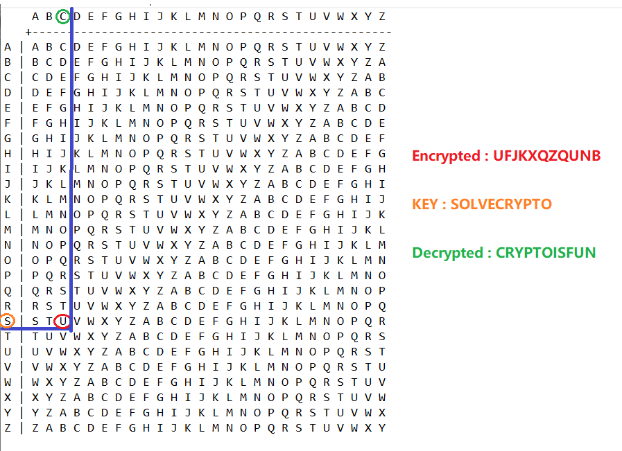

# easy 1

[toc]

## Description
> AUTHOR: ALEX FULTON/DANNY

> Description
The one time pad can be cryptographically secure, but not when you know the key. Can you solve this? We've given you the encrypted flag, key, and a table to help `UFJKXQZQUNB` with the key of `SOLVECRYPTO`. Can you use this [`table`](./table.txt) to solve it?.

## Solution
The challenge provided a [table.txt](./table.txt). From the table, we know that this is an Vigenere cipher table.
So we can decrypt the encrypted flag with the key provided : `SOLVECRYPTO`

The way to decrypt it is using the `key` compared with the table.
Take a look for the solving step below :

1. First, we need to look at the left hand side, and find the row with the first key : S
2. Then, find the first encrypted alphabet in the same row : U
3. After that, we got the decrypted alphabet at the top of the column : C

and so on.



Finally, we got the decrypted flag : `CRYPTOISFUN`

## Flag
```
picoCTF{CRYPTOISFUN}
```
